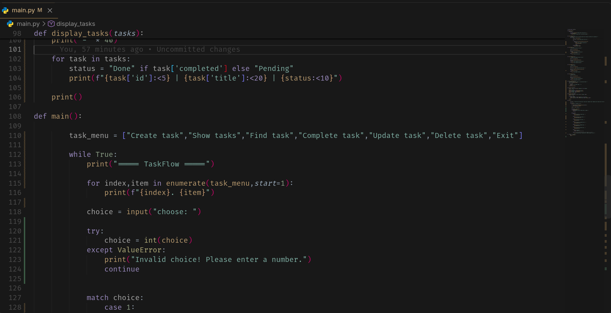
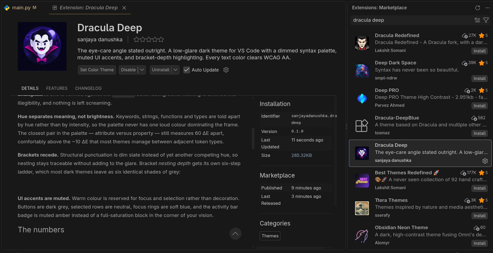
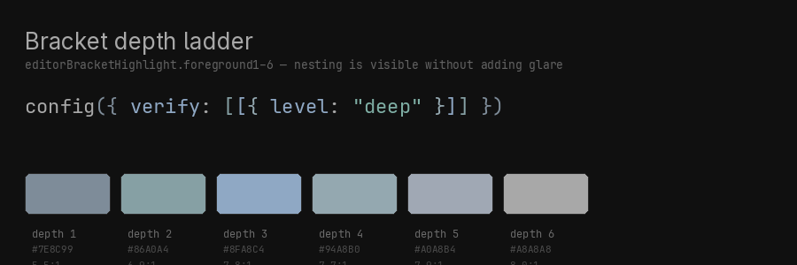
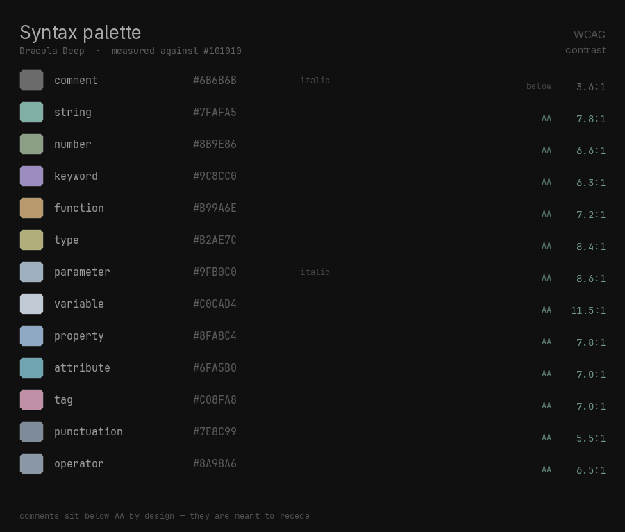

<p align="center">
  
</p>

<h1 align="center">Dracula Deep</h1>

<p align="center"><strong>The eye-care angle stated outright.</strong></p>

<p align="center">
  A low-glare dark theme for VS Code. Every foreground measured against the
  background, nothing left at maximum brightness.
</p>






---

## The problem

Most dark themes are tuned by eye, and the eye is generous. The usual result is
a pure-white foreground sitting at **19:1** against the editor background, amber
accents smeared across fifteen different UI slots, and bright greens that pull
focus away from the code you're actually reading.

None of that is a mistake on screen. Over a six-hour session it is a tax.

## What Dracula Deep does differently

**A palette with measurements, not vibes.** Every token colour is chosen to sit
in a narrow band of brightness and is verified against the `#101010` editor
background. Nothing is dimmed into illegibility, and nothing is left screaming.

**Hue separates meaning, not brightness.** Keywords, strings, functions and
types are told apart by hue rather than by intensity, so the palette never has
one loud colour dominating the frame. The closest pair in the palette —
attribute versus property — still measures 60 ΔE apart, comfortably above the
~10 ΔE that most themes manage between adjacent token types.

**Brackets recede.** Structural punctuation is dim slate instead of yet another
competing hue, so nesting stays traceable without adding to the glare. Bracket
*nesting depth* gets its own six-step ladder, which most dark themes leave as six
identical shades of grey:



**UI accents are muted.** Warm colour is reserved for focus and selection rather
than decoration. Buttons are dark grey, selected rows are neutral, focus rings
are soft blue, and the activity bar badge is muted amber instead of a
full-saturation block in the corner of your vision.

## The numbers



| Role | Colour | Contrast |
|:--|:--|--:|
| plain text | `#A8A8A8` | 8.0:1 |
| variables | `#C0CAD4` | 11.5:1 |
| parameters | `#9FB0C0` *italic* | 8.6:1 |
| strings | `#7FAFA5` | 7.8:1 |
| numbers, constants | `#8B9E86` | 6.6:1 |
| keywords | `#9C8CC0` | 6.3:1 |
| functions | `#B99A6E` | 7.2:1 |
| types, classes | `#B2AE7C` | 8.4:1 |
| properties | `#8FA8C4` | 7.8:1 |
| tags | `#C08FA8` | 7.0:1 |
| attributes | `#6FA5B0` | 7.0:1 |
| brackets | `#7E8C99` | 5.5:1 |
| comments | `#6B6B6B` *italic* | 3.6:1 |

Every token clears **WCAG AA** (4.5:1). Comments are deliberately below it at
3.6:1 — making them recede is the entire point of a comment.

## Install

From the marketplace:

```
ext install sanjayadanushka.dracula-deep
```

Or build from source:

```sh
git clone https://github.com/Sanjaya-Danushka/Dracula-Deep.git
cd Dracula-Deep
npm install -g @vscode/vsce
vsce package
code --install-extension dracula-deep-0.1.1.vsix
```

Then open the theme picker with <kbd>Ctrl</kbd>+<kbd>K</kbd>
<kbd>Ctrl</kbd>+<kbd>T</kbd> and select **Dracula Deep**.

Requires VS Code 1.80 or newer.

## Verify it yourself

The numbers in this README are not marketing copy — they are generated, and you
can re-run them.

```sh
# every token against WCAG AA
python3 scripts/check-contrast.py

# regenerate the palette and ladder images from the theme file
python3 scripts/render-preview.py
```

`check-contrast.py` exits non-zero if any token drops below AA, so it works as a
CI gate. The palette and ladder imagery is rendered from
`themes/dracula-deep-color-theme.json` rather than hand-picked, which means the
README cannot quietly drift away from the palette that actually ships.

## Author

**Sanjaya Danushka** — <dsanjaya712@gmail.com>

## Licence

MIT
